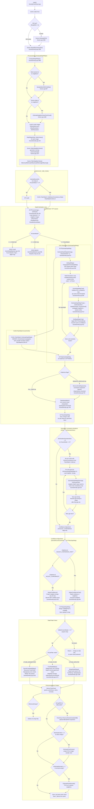

# DensifyPointCloud Pipeline

```mermaid
graph TD
    A["main()\nDensifyPointCloud.cpp"] --> B["scene.Load(.mvs)"]
    B --> C{"ROI set?\n(fScaleROI > 0)"}
    C -->|No ROI| D["Scene::EstimateROI()\nScene.cpp:2380"]
    C -->|ROI exists| E["Scene::DenseReconstruction()\nSceneDensify.cpp:1908"]
    D --> E

    E --> F["ComputeDepthMaps()\nSceneDensify.cpp:1985"]

    subgraph PRE ["Pre-processing (ComputeDepthMaps)"]
        F --> G{"Mesh present &\nno neighbors?"}
        G -->|Yes| H["SampleMeshWithVisibility()\nScene.cpp:667"]
        G -->|No| I{"Scene empty &\nno neighbors?"}
        H --> I
        I -->|Yes| J["EstimateNeighborViewsPointCloud()\nScene.cpp:1188"]
        I -->|No| K["Load & scale images\nnResolutionLevel / nMaxResolution / nMinResolution"]
        J --> K
        K --> L["DepthMapsData::SelectViews()\nfor each image\nSceneDensify.cpp:149"]
        L --> M["Scene::SelectNeighborViews()\ngeometric scoring: area/scale/angle\nScene.cpp:1247"]
        M --> N["Scene::FilterNeighborViews()\nfMinArea/fMinScale/fMaxScale/fMinAngle/fMaxAngle"]
    end

    subgraph CUDA_INIT ["CUDA Init (if _USE_CUDA)"]
        N --> O{"desiredDeviceIDs\nnot empty &\nnFusionMode >= 0?"}
        O -->|Yes| P["CUDA::PatchMatch::Init(bGeomConsistency=false)\nPatchMatchCUDA.inl"]
        O -->|No| Q["CPU path"]
    end

    subgraph ESTLOOP ["Depth Estimation Loop\n(DenseReconstructionEstimate / EVT queue)"]
        P --> R["EVTProcessImage → InitViews()\nSceneDensify.cpp:183\nLoad reference + N neighbor images\n(nNumViews, fViewMinScore, fViewMinScoreRatio)"]
        Q --> R
        R --> S{"nFusionMode?"}

        S -->|">= 0 PatchMatch"| T["EVTEstimateDepthMap\n→ EstimateDepthMap(idxImage, nGeometricIter=-1)\nSceneDensify.cpp:510"]
        S -->|"== -1 SGM only"| U["SGM::Match()\nSemiGlobalMatcher.cpp:536\nDisparity map per pair"]
        S -->|"== -2 SGM fuse"| V["SGM::Fuse()\nSemiGlobalMatcher.cpp:746\nFuse disparity maps → depth map"]

        subgraph PM_CPU ["CPU PatchMatch (EstimateDepthMap)"]
            T --> W["InitDepthMap()\nTriangulatePoints2DepthMap\nfrom sparse point cloud\nSceneDensify.cpp:356"]
            W --> X["Multi-Resolution Loop\nnSubResolutionLevels coarse-to-fine\nscale = 1/2^level"]
            X --> Y["ScoreDepthMapTmp()\nInitialize NCC confidence map\nper pixel (multi-threaded)\nSceneDensify.cpp:384"]
            Y --> Z["EstimateDepthMapTmp() x nEstimationIters\nDepthEstimator::ProcessPixel()\npropagate neighbors + random refine\nSceneDensify.cpp:413"]
            Z --> AA["EndDepthMapTmp()\nApply fNCCThresholdKeep\nConvert score to confidence\nSceneDensify.cpp:422"]
            AA --> AB{"More sub-resolution\nlevels?"}
            AB -->|Yes upsample| X
            AB -->|No| AC["EVTOptimizeDepthMap\n(if nOptimize & OPTIMIZE)"]
        end

        subgraph PM_CUDA ["CUDA PatchMatch (if pmCUDA)"]
            T --> AD["CUDA::PatchMatch::EstimateDepthMap()\nAMHMVS checkerboard propagation\nGPU parallel red-black pattern\nPatchMatchCUDA.inl"]
            AD --> AC
        end

        AC --> AE{"nOptimize flags?"}
        AE -->|REMOVE_SPECKLES bit| AF["RemoveSmallSegments()\nconnected-component flood fill\nnSpeckleSize threshold\nSceneDensify.cpp:704"]
        AE -->|FILL_GAPS bit| AG["GapInterpolation()\nrow+column linear interpolation\nnIpolGapSize threshold\nSceneDensify.cpp:798"]
        AF --> AG
        AG --> AH["EVTSaveDepthMap\nSave .dmap to disk\n(or geo.dmap for geometric iters)"]
    end

    subgraph GEOM ["Geometric Consistency Iterations\n(nEstimationGeometricIters)"]
        AH --> AI{"nEstimationGeometricIters > 0\n& nFusionMode >= 0?"}
        AI -->|Yes| AJ["Re-init CUDA with bGeomConsistency=true\nPatchMatch::Init(true)"]
        AJ --> AK["For each geo iter:\nInitViews(loadDepthMaps=1)\nLoad neighbor .dmaps"]
        AK --> AL["EstimateDepthMap(idxImage, nGeometricIter)\nneighbor depth maps used for\ncross-view consistency cost\nSceneDensify.cpp:510"]
        AL --> AM["Save geo.dmap\nRename geo.dmap to .dmap\nafter final geo iter"]
        AM --> AN{"More geo iters?"}
        AN -->|Yes| AK
        AN -->|No| AO["Confidence Adjustment\n(if ADJUST_CONFIDENCE flags set)"]
        AI -->|No| AO
    end

    subgraph CONFADJ ["Confidence Adjustment\n(DenseReconstructionFilter / EVTFilterDepthMap)"]
        AO --> AP{"nOptimize &\nADJUST_CONFIDENCE_FAST?"}
        AP -->|Yes| AQ["AdjustConfidenceFast()\nDepth similarity vs neighbors\nGaussian-weighted\nSceneDensify.cpp:944"]
        AP --> AR{"nOptimize &\nADJUST_CONFIDENCE?"}
        AR -->|Yes| AS["AdjustConfidence()\nProject neighbor dmaps into ref view\nMerrell 2007 visibility fusion\nSceneDensify.cpp:1022"]
        AQ --> AT["EVTAdjustDepthMap\nMerge confMapFast & confMap\nSave updated .dmap"]
        AS --> AT
    end

    subgraph FUSION ["Depth Map Fusion"]
        AT --> AU{"ABS(nFusionMode) == 1?\n(export only)"}
        AU -->|Yes return| AV["Return — .dmaps on disk only\nno point cloud produced"]
        AU -->|No| AW{"nFuseFilter mode?"}

        AW -->|0 FUSE_NOFILTER| AX["MergeDepthMaps()\nProject each pixel to 3D\nNo filtering / deduplication\nSceneDensify.cpp:1238"]
        AW -->|1 FUSE_FILTER| AY["FuseDepthMaps()\nDMapCache LRU caching\nDepth+normal agreement check\nWeighted average, nMinViewsFuse threshold\nSceneDensify.cpp:1371"]
        AW -->|2 FUSE_DENSEFILTER| AZ["DenseFuseDepthMaps()\nRecursive FusePoint()\nReprojection error check\nMedian 3D position\nSceneDensify.cpp:1623"]
    end

    subgraph POSTPROC ["Post-processing & Output"]
        AX --> BA["Dense PointCloud\n(points, pointViews, colors, normals)"]
        AY --> BA
        AZ --> BA

        BA --> BB{"bCrop2ROI &\nIsBounded?"}
        BB -->|Yes| BC["PointCloud::RemovePointsOutside(OBB)\noptional fBorderROI expansion"]
        BB -->|No| BD
        BC --> BD{"nEstimateColors == 1\n& colors empty?"}
        BD -->|Yes| BE["EstimatePointColors()\nproject 3D to image, sample color"]
        BD -->|No| BF{"nEstimateNormals == 1\n& normals empty?"}
        BE --> BF
        BF -->|Yes| BG["EstimatePointNormals()\nPCA on k-nearest neighbors"]
        BF -->|No| BH["Save .ply dense point cloud\nSave _dense.mvs scene"]
        BG --> BH

        BA --> BI{"bRemoveDmaps?"}
        BI -->|Yes| BJ["Delete all .dmap files"]
    end
```
