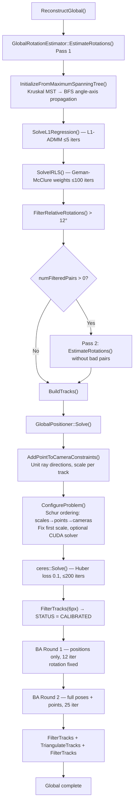

```mermaid
graph TD
    G0["ReconstructGlobal()"] --> G1["GlobalRotationEstimator::EstimateRotations() Pass 1"]
    G1 --> G1b["InitializeFromMaximumSpanningTree()\nKruskal MST → BFS angle-axis propagation"]
    G1b --> G1d["SolveL1Regression() — L1-ADMM ≤5 iters"]
    G1d --> G1e["SolveIRLS() — Geman-McClure weights ≤100 iters"]
    G1e --> G1g["FilterRelativeRotations() > 12°"]

    G1g --> G2{"numFilteredPairs > 0?"}
    G2 -->|Yes| G3["Pass 2: EstimateRotations() without bad pairs"]
    G2 -->|No| G4
    G3 --> G4

    G4["BuildTracks()"] --> G5["GlobalPositioner::Solve()"]
    G5 --> G5c["AddPointToCameraConstraints()\nUnit ray directions, scale per track"]
    G5c --> G5f["ConfigureProblem()\nSchur ordering: scales→points→cameras\nFix first scale, optional CUDA solver"]
    G5f --> G5g["ceres::Solve() — Huber loss 0.1, ≤200 iters"]

    G5g --> G6["FilterTracks(6px) → STATUS = CALIBRATED"]
    G6 --> G7["BA Round 1 — positions only, 12 iter\nrotation fixed"]
    G7 --> G8["BA Round 2 — full poses + points, 25 iter"]
    G8 --> G9["FilterTracks + TriangulateTracks + FilterTracks"]
    G9 --> GDONE["Global complete"]
```