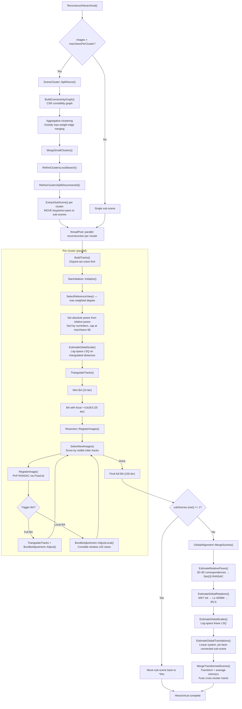

```mermaid
graph TD
    H0["ReconstructHierarchical()"] --> H1{"images > maxViewsPerCluster?"}

    H1 -->|Yes| H2["SceneCluster::SplitScene()"]
    H2 --> H2a["BuildConnectivityGraph()\nCSR covisibility graph"]
    H2a --> H2b["Aggregative clustering\nGreedy max-weight edge merging"]
    H2b --> H2c["MergeSmallClusters()"]
    H2c --> H2d["RefineClustersLocalSearch()"]
    H2d --> H2e["RefineClustersSplitDisconnected()"]
    H2e --> H2f["ExtractSubScene() per cluster\nMOVE keypoints+pairs to sub-scenes"]
    H1 -->|No| H3["Single sub-scene"]
    H2f --> H4
    H3 --> H4

    H4["threadPool: parallel reconstruction per cluster"] --> H5

    subgraph "Per-cluster (parallel)"
        H5["BuildTracks()\nDisjoint-set union-find"] --> H6["StarInitializer::Initialize()"]
        H6 --> H6a["SelectReferenceView() — max weighted degree"]
        H6a --> H6b["Set absolute poses from relative poses\nSort by numInliers, cap at maxViews=36"]
        H6b --> H6e["EstimateGlobalScale()\nLog-space LSQ on triangulated distances"]
        H6e --> H6f["TriangulateTracks()"]
        H6f --> H6g["Mini BA (10 iter)"]
        H6g --> H6i["BA with focal + k1k2k3 (25 iter)"]

        H6i --> H7["Resection::RegisterImages()"]
        H7 --> H7a["SelectNextImages()\nScore by visible inlier tracks"]
        H7a --> H7b["RegisterImage()\nPnP RANSAC via PoseLib"]
        H7b --> H7c{"Trigger BA?"}
        H7c -->|Full BA| H7d["TriangulateTracks + BundleAdjustment::Adjust()"]
        H7c -->|Local BA| H7e["BundleAdjustment::AdjustLocal()\nCovisible window ≤25 views"]
        H7d --> H7a
        H7e --> H7a
        H7a -->|Done| H7g["Final full BA (100 iter)"]
    end

    H7g --> H9{"subScenes.size() == 1?"}
    H9 -->|Yes| H10["Move sub-scene back to *this"]
    H9 -->|No| H11["GlobalAlignment::MergeScenes()"]
    H11 --> H11a["EstimateRelativePoses()\n3D-3D correspondences → Sim(3) RANSAC"]
    H11a --> H11b["EstimateGlobalRotations()\nMST init → L1-ADMM → IRLS"]
    H11b --> H11c["EstimateGlobalScales()\nLog-space linear LSQ"]
    H11c --> H11d["EstimateGlobalTranslations()\nLinear system, pin best-connected sub-scene"]
    H11d --> H11e["MergeTransformedScenes()\nTransform + average intrinsics\nFuse cross-cluster tracks"]
    H10 --> HDONE["Hierarchical complete"]
    H11e --> HDONE
```