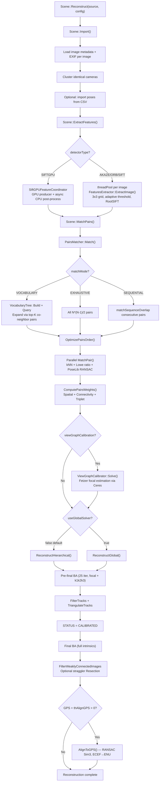

```mermaid
graph TD
    A["Scene::Reconstruct(source, config)"] --> B["Scene::Import()"]
    B --> B2["Load image metadata + EXIF per image"]
    B2 --> B3["Cluster identical cameras"]
    B3 --> B4["Optional: import poses from CSV"]

    B4 --> C["Scene::ExtractFeatures()"]
    C --> C1{"detectorType?"}
    C1 -->|SIFTGPU| C2["SiftGPUFeatureCoordinator\nGPU producer + async CPU post-process"]
    C1 -->|AKAZE/ORB/SIFT| C3["threadPool per image\nFeaturesExtractor::ExtractImage()\n3x3 grid, adaptive threshold, RootSIFT"]

    C2 --> D
    C3 --> D

    D["Scene::MatchPairs()"] --> D1["PairsMatcher::Match()"]
    D1 --> D2{"matchMode?"}
    D2 -->|VOCABULARY| D3["VocabularyTree: Build + Query\nExpand via top-K co-neighbor pairs"]
    D2 -->|EXHAUSTIVE| D4["All N*(N-1)/2 pairs"]
    D2 -->|SEQUENTIAL| D5["matchSequenceOverlap consecutive pairs"]
    D3 --> D7["OptimizePairsOrder()"]
    D4 --> D7
    D5 --> D7
    D7 --> D8["Parallel MatchPair()\nkNN + Lowe ratio + PoseLib RANSAC"]
    D8 --> D10["ComputePairsWeights()\nSpatial + Connectivity + Triplet"]
    D10 --> D11{"viewGraphCalibration?"}
    D11 -->|Yes| D12["ViewGraphCalibrator::Solve()\nFetzer focal estimation via Ceres"]
    D11 -->|No| E
    D12 --> E

    E{"useGlobalSolver?"} -->|false default| F["ReconstructHierarchical()"]
    E -->|true| G["ReconstructGlobal()"]

    F --> POST1
    G --> POST1
    POST1["Pre-final BA (25 iter, focal + k1k2k3)"] --> POST2["FilterTracks + TriangulateTracks"]
    POST2 --> POST3["STATUS = CALIBRATED"]
    POST3 --> POST4["Final BA (full intrinsics)"]
    POST4 --> POST5["FilterWeaklyConnectedImages\nOptional straggler Resection"]
    POST5 --> POST6{"GPS + thAlignGPS > 0?"}
    POST6 -->|Yes| POST7["AlignToGPS() — RANSAC Sim3, ECEF→ENU"]
    POST6 -->|No| DONE
    POST7 --> DONE["Reconstruction complete"]
```
